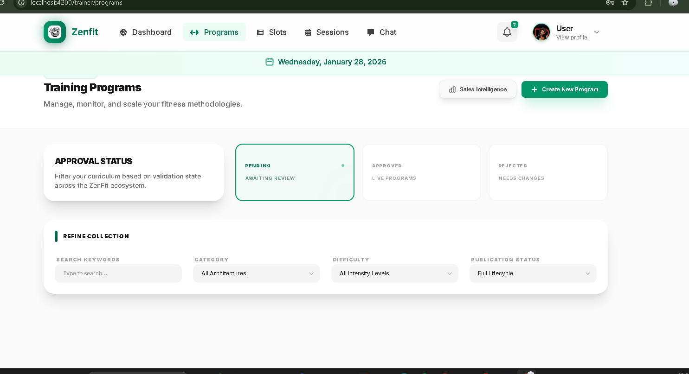

# ZenFit UI Redesign Progress

## ✅ Completed Components

### 1. **Design System Foundation** (styles.css)
- ✅ Modern color palette (Indigo/Violet primary, Teal/Cyan secondary)
- ✅ Comprehensive CSS variables for colors, typography, spacing
- ✅ Reusable component classes (buttons, cards, badges, forms)
- ✅ Custom animations (float, pulse-glow, fadeIn, slideIn, scaleIn)
- ✅ Typography system with heading and body text utilities
- ✅ Gradient utilities

### 2. **Global Configuration**
- ✅ Updated index.html with Google Fonts (Inter, Outfit, Playfair Display)
- ✅ Tailwind v4 configuration in styles.css

### 3. **Layout Components**
- ✅ **FooterComponent**: Modern dark footer with brand section, quick links, support, newsletter
- ✅ **UserLayoutComponent**: Updated to include footer and improved spacing

### 4. **User Dashboard**
- ✅ Hero welcome section with gradient background
- ✅ Quick stats grid (4 metric cards)
- ✅ BMI Calculator integration
- ✅ Quick action cards for navigation
- ✅ Modern animations and hover effects
- ✅ **Slot Management (Trainer)**: Redesigned with 'Control Center' aesthetic and architectural blueprints

### 5. **High-Density Refinement (Shrink UI)**
- ✅ **Global Typography**: Downscaled heading and body text scales for a more professional, compact look.
- ✅ **Program Card**: Reduced dimensions, padding, and font sizes.
- ✅ **Purchased Programs (Sales Stats)**: Compacted matrix cards, table rows, and status badges.
- ✅ **Program Users (Member Network)**: Reduced avatar sizes, table padding, and header height.
- ✅ **Slot Management (Trainer)**: Condensed form inputs, template list items, and instance logs.
- ✅ **Bug Fixes**: Resolved all Angular compiler HTML structure errors (unclosed divs and control flow blocks) and Tailwind class references.
- ✅ **Trainer Profile**: Scaled down fonts, components, and padding for a high-density, professional layout.
- ✅ **Training Program Tabs**: Reimplemented session-style tabs for program status filtering.
- ✅ **Compact Header**: Reduced height (h-16), font sizes (text-sm), and icon dimensions across nav and user profile.
- ✅ **Build Status**: Verified core trainer components compile successfully.

## 🚧 Components to Update

### High Priority (Core User Experience)
1. **Landing Page** - Already has modern design, may need minor tweaks
2. **Program List** - ✅ Card designs updated, filters and tabs modernized.
3. **Program Details** - Enhance visual hierarchy
4. **Slot List** - Already modernized
5. **BMI Calculator** - Already has modern design
6. **User Profile** - Needs redesign
7. **Booked Slots** - Needs redesign
8. **Transaction History** - Needs redesign

### Medium Priority (Supporting Pages)
9. **Program Category List** - Needs redesign
10. **Payment Pages** (Success/Failed) - Needs redesign
11. **User Chat** - Needs redesign

### Low Priority (Shared Components)
12. **Header Component** - ✅ Compacted height, reduced font sizes (text-sm), and downscaled logo/profile icons.
13. **Search Bar** - Verify consistency
14. **Notification Component** - Verify consistency

## 🎨 Design Principles Applied

1. **Modern Color System**: Moved from emerald/green to sophisticated indigo/violet with teal accents
2. **Premium Typography**: Inter for body, Outfit for headings, Playfair Display for accents
3. **Generous Spacing**: 8px grid system with ample whitespace (Refined to **High Density** in v2)
4. **Smooth Animations**: Micro-interactions on hover, transitions, and state changes
5. **Consistent Components**: Reusable button, card, and badge styles
6. **Responsive Design**: Mobile-first approach with breakpoints
7. **Visual Hierarchy**: Clear heading structure and content organization
8. **Accessibility**: Semantic HTML, proper contrast ratios
9. **Compact Efficiency**: Reduced visual noise and maximized screen real estate for data-heavy views.

## 📋 Next Steps

1. Run the application and verify no further HTML structure errors exist.
2. Review Student/User components (Profile, Booked Slots) to align with new compact density.
3. Test responsive behavior with new smaller touch targets.

## 🔧 Technical Notes

- Using Tailwind CSS v4 with @theme directive
- Angular 20+ standalone components
- All business logic and API calls preserved
- State management untouched
- Component behavior unchanged
